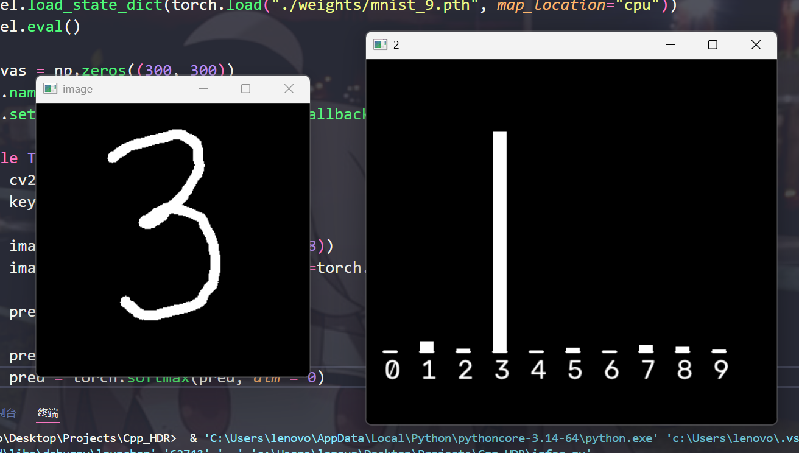

## 基于C++推理的MNIST手写数字识别

### 项目简介
本项目首先使用PyTorch基于MNIST数据集训练了一个全连接手写数字识别模型，并导出权重，随后使用C++不调用第三方库实现了模型推理任务，并支持键盘绘图及概率分布可视化。
其中矩阵运算基于SIMD(AVX2)指令集+多线程优化，未来将会基于此尝试独立构建高性能深度学习计算库。本项目仅作为一个学习基线。

### 快速开始
首先要确保你的CPU支持AVX2指令集(~~废话~~)
```python
# 运行这个命令开始模型训练
# 在本训练参数下迭代8~10个epoch基本收敛
python train.py

# 训练完成后，可以运行这个脚本简单看一下模型效果
python infer.py

# 运行以下脚本方可导出模型权重，供后续C++读取
python weight.py
```



如果效果满意，可以运行以下指令编译main.cpp:
```
g++ -fdisgnostics-color=always -g main.cpp -mavx2 -mfma -o ./main.exe 
```
运行后，输入权重所在文件夹的**绝对路径**，如果一切正常你将会在控制台中看到以下界面：

通过方向键(↑↓←→)控制光标移动，按下"S"键绘制一个像素，绘制完成后按下"R"键即可推理并输出概率分布。


锵锵~~~~古法编程万岁！~~(๑•̀ㅂ•́)و✧